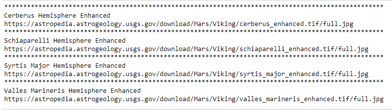

# Web-Scraping-Challenge
### By Karla M. Murphy

## Objective
- build a web application that scrapes various websites for data related to the Mission to Mars and displays the information in a single HTML page from different web pages from NASA.
  - [NASA Mars News Site](https://mars.nasa.gov/news/)
  - [NASA Mars Facts](https://space-facts.com/mars/)
  - [NASA Mars Hemispheres](https://astrogeology.usgs.gov/search/results?q=hemisphere+enhanced&k1=target&v1=Mars)
 
 ************
 ## Step 1 - Scraping
 
A. NASA NEWS=> Scrape [NASA Mars News Site](https://mars.nasa.gov/news/) and collect the latest News Title and Paragraph Text. Assign the text to variables that you can reference later.

  - On the Jupyter Notebook for this section, the date was added as sample to visualized when those news were captured.

B. NASA MARS PROFILE=> Visit [Mars Facts webpage](https://space-facts.com/mars/) and use Pandas to scrape the table containing facts about the planet including Diameter, Mass, etc.
  
 

 
   - On the Jupyter Notebook, first extraction without modifications.
 

C. MARS HEMISPHERES=> Visit the [USGS Astrogeology site](https://astrogeology.usgs.gov/search/results?q=hemisphere+enhanced&k1=target&v1=Mars) to obtain high resolution images for each of Mar's hemispheres.
 

   - Jupyter Notebook, hemisphere_image_urls.      
      
   
 ## Step 2 - MongoDB and Flask Application
 Use MongoDB with Flask templating to create a new HTML page that displays all of the information that was scraped from the URLs above.
  * MongoDB

      
  * HTML scrape page
  

 

 
 
 

  
